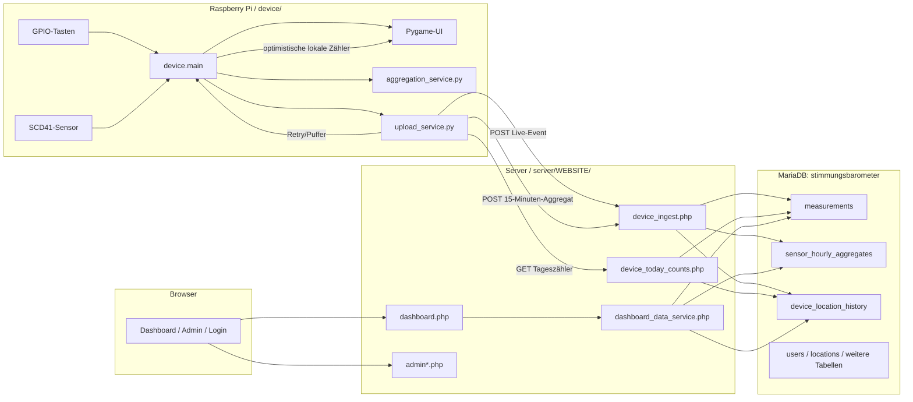
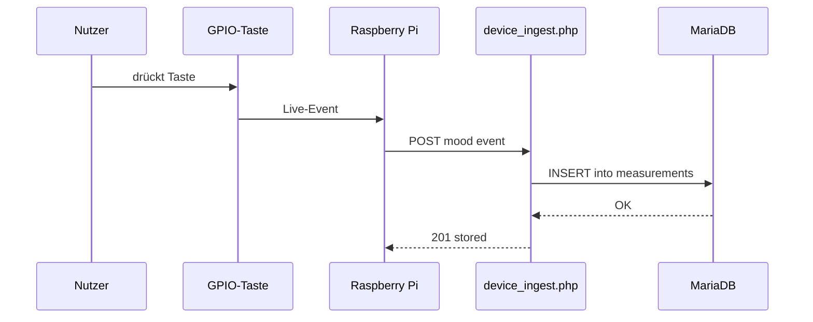
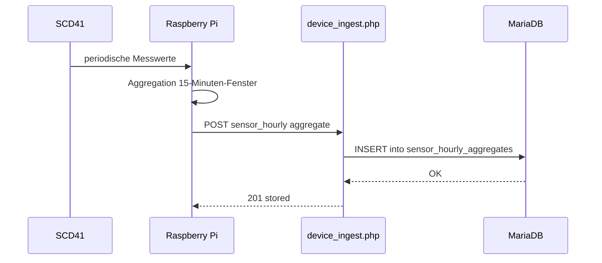

# Architekturüberblick

## Produktions-Stack (aktiv)



## Datenfluss (Produktion)

1. GPIO-Tasten auf dem Device erhöhen die sichtbaren Pi-Stimmungszähler optimistisch im Speicher; der SCD41-Sensor wird periodisch ausgelesen.
   Die sichtbare Pi-UI wird per Desktop-Autostart mit `start_ui.sh` gestartet; für Routine-Neustarts/Deploys dienen
   `./restart` / `update_pi.sh`. Es darf nur eine `python -m device.main`-Instanz laufen (keine parallele
   `systemd`-Runtime für `device.main`).
2. Alle 15 Minuten sendet das Device einen Sensor-Aggregat-Payload (`sensor_avg`, `sample_count`) an
   `device_ingest.php`, der genau das abgeschlossene 15-Minuten-Fenster abdeckt (`HH:00–HH:15`, `HH:15–HH:30`,
   `HH:30–HH:45`, `HH:45–HH+1:00`). Jeder Tastendruck löst zusätzlich einen sofortigen Live-Event-Upload
   über denselben Endpunkt aus.
3. `device_ingest.php` schreibt Live-Events in `measurements` und Sensoraggregate in
   `sensor_hourly_aggregates` (MariaDB). Die beiden Pfade sind strikt getrennt: Sensoraggregate
   erzeugen **keine** Stimmungsvotes.
4. Das Dashboard liest Stimmungszähler aus `measurements` und Sensordaten aus
   `sensor_hourly_aggregates` über `dashboard_data_service.php`. Der Pi liest die
   maßgeblichen Stimmungszähler des aktuellen Tages über den Read-only-Endpunkt `device_today_counts.php`
   und gleicht seine optimistischen lokalen Deltas nach erfolgreichen Uploads wieder ab.
5. Fehlgeschlagene Uploads werden lokal in `device/pending_uploads.json` gepuffert und automatisch erneut versucht.
   Doppelte Aggregat-Übermittlungen (gleiches `location_id + period_start + period_end`) werden
   serverseitig mit `409` abgelehnt und auf dem Device als Erfolg behandelt.

> **Keine Doppelzählung:** Live-Uploads sind die einzige Quelle für Stimmungsmessungen. Sensor-Aggregat-
> Uploads schreiben nur in `sensor_hourly_aggregates` und beeinflussen niemals die Stimmungszähler.

## Sequenzdiagramm: Live-Event bei Tastendruck



## Sequenzdiagramm: 15-Minuten-Sensoraggregat



## Architekturentscheidung: SQL statt JSON

- MariaDB / SQL ist der maßgebliche Datenspeicher für SIA V2.
- JSON (`pending_uploads.json`) ist nur ein lokaler Retry-Puffer für Offline-/fehlgeschlagene Uploads.
- Die heutige Stimmungsanzeige des Pi nutzt Basiszähler vom Server plus Pending-Deltas im Speicher;
  `pending_uploads.json` ist niemals die Source of Truth für angezeigte Zähler.
- Aggregation, Filterung und historische Ansichten werden serverseitig in PHP/SQL umgesetzt.

## Verzeichnisstruktur

```text
SIA_V2/
├── device/                   # Läuft auf dem Raspberry Pi
│   ├── config.py             # Gesamte Konfiguration – per Env-Variablen überschreibbar
│   ├── main.py               # Einstiegspunkt, Hauptschleife
│   ├── gpio_handler.py       # Tastereingaben + Entprellung
│   ├── sensor_service.py     # SCD41-Sensor (oder Simulation)
│   ├── aggregation_service.py# Baut 15-Minuten-Sensoraggregat-Payload
│   ├── upload_service.py     # HTTP-Upload + Retry-Puffer
│   ├── ui.py                 # Pygame-Anzeige
│   └── models.py             # Dataclasses, die innerhalb von device/ geteilt werden
│
├── server/
│   ├── WEBSITE/              # ★ PRODUKTION – PHP-App ausgeliefert durch nginx + php-fpm
│   │   ├── device_ingest.php # POST-Endpunkt für den Pi (schreibt measurements)
│   │   ├── dashboard.php     # Dashboard-UI
│   │   ├── dashboard_data.php / dashboard_data_service.php
│   │   ├── admin*.php        # Admin-Seiten (Standorte, Benutzer, manuelle Messungen)
│   │   ├── db.php            # DB-Konfigurations-Loader
│   │   └── db.local.php      # Server-lokale Zugangsdaten (nie committen)
│   │
│   ├── main.py               # FastAPI-App (alternativ/dev – siehe unten)
│   ├── routes/               # FastAPI-Routen (alternativ/dev)
│   └── stimmungsbarometer.sql# MariaDB-Schema + Beispieldaten
│
└── docs/
    ├── architecture.md       # Diese Datei
    ├── api.md                # Endpunkt-Referenz (PHP-Produktion + FastAPI-Alternative)
    ├── deployment_tailscale.md
    └── tailscale-setup.md
```

## Technologiewahl

| Ebene | Technologie | Rolle |
|-------|-------------|-------|
| Device | Python + Pygame | Läuft auf dem Pi, UI ohne Browser |
| Server | Python + PHP + nginx + php-fpm | **Produktive** Web-App und Ingest-Endpunkt |
| DB | MariaDB (`stimmungsbarometer`) | **Produktiver** Datenspeicher |
| Netzwerk | Tailscale | VPN, damit der Pi den Server erreichen kann |
| Server (alt) | FastAPI + SQLAlchemy | Alternativer/Entwicklungspfad (nicht deployt) |
| DB (alt) | PostgreSQL | Wird nur mit dem alternativen FastAPI-Pfad verwendet |

## Alternativer / Entwicklungs-Pfad (nicht Produktion)

Das Repository enthält außerdem ein Python/FastAPI-Backend (`server/main.py`, `server/routes/`) und
zugehörige Tests (`tests/`). Dieser Code war der ursprüngliche Prototyp und bleibt für
Entwicklung und Experimente erhalten. Er ist **nicht** in Produktion deployt.

So startest du den FastAPI-Server lokal:

```bash
pip install -r requirements-server.txt
uvicorn server.main:app --host 0.0.0.0 --port 8000
pytest
```
